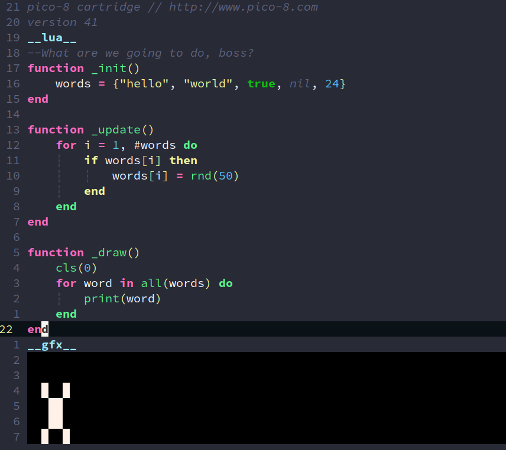

## Dependencies

* [nvim-treesitter](https://github.com/nvim-treesitter/nvim-treesitter)

## USAGE

```lua
require("nvim-treesitter.parsers").get_parser_configs().pico8 = {
  install_info = {
    url = "https://github.com/paradoxskin/tree-sitter-pico8.git",
    files = {"src/parser.c"},
  },
  filetype = "pico8"
}
```

then `:TSInsall pico8` and wait the compiling.

## Preview



---

Fix bugs, welcome PR.